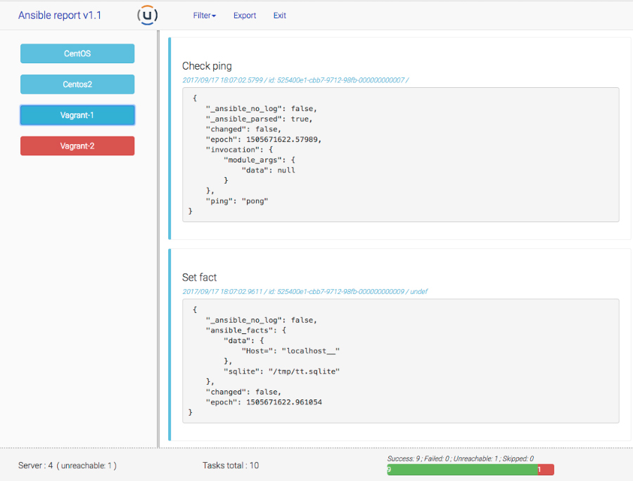

ansible-report
=

This script create a temporary tiny web server where you can analyse your ansible report in a web interface (bootstrap template).

Step after doing git clone :

- Add these lines in your .ansible.cfg (defaults section)

```
callback_plugins    = <where you install ansible-report>/callbackplugin
callback_whitelist  = ansible-report
stdout_callback     = ansible-report
```

- Add these variable in you .bash_profile
```
export ANSIBLE_REPORT_PORT=8180
export ANSIBLE_REPORT_FILE=~/ansible_report.json
```

and update your PATH profile to add full path where you've installed ansible-report.


Usage :

```
$ ansible-report
Load file : /home/manu/ansible_report.json

Open browser and load : http://myhostname:8180


or

$ ansible-report <file.json>

( Note : Python 2.7 need to be installed on your system )

```


